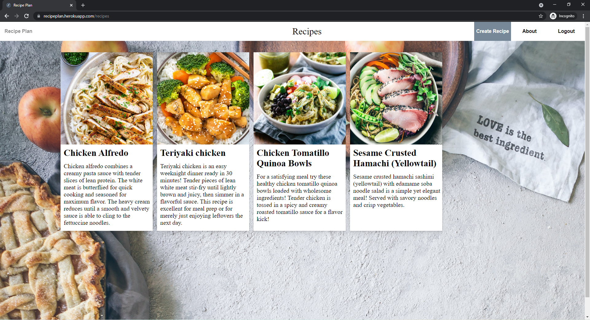

## Recipe Plan Overview
Recipe Plan is a full stack app that lets users create recipes and make meal plans using those recipes.

## Database Schema
Recipe Plan uses a Flask-SQLAlchemy backend to store its data. Then the information that is stored is passed Redux in the frontend.

## Frontend Overview
Recipe Plan uses React and Redux to handle the front end. React is used to handle components and to react to changes being made on the page. Redux stores data so that the app can be more responsive compared to fetching multiple times, redux can store the results of one fetch.

## Future Features
Recipe Plan currently does not have the meal plan aspect implemented, so that will be the next thing added.

Another feature that will be added is a search bar. It will be able to search by meal name, ingredients, and other more specific searches.

A feature I would like to add is a grocery list, that is tied to the meal plan. When the user makes a meal plan, they are asked if they want to make a grocery list that includes every ingredient needed for their meals.
